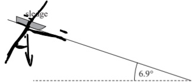

13 A sledge accelerates, due to gravity, from rest down a frictionless slope. Air resistance can be ignored. The slope is at an angle of 6.9 to the horizontal, as shown.

(a) Complete the free-body force diagram below for the sledge.

$$\int\limits_{v\cos t.}^{\pi}d t $$

(b) The slope has a total length of 60 m.

(i) Show that the initial acceleration of the sledge along the slope is about 1 ms2.

$$9.81\sin(b-q)$$

(ii) Determine the speed of the sledge at the end of the slope.

$$v^{2}=u^{2}+2\times1.10k68$$

